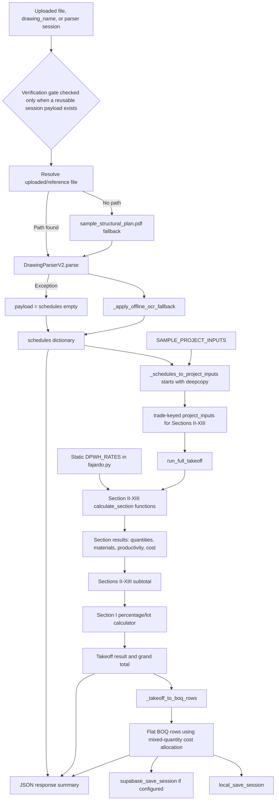
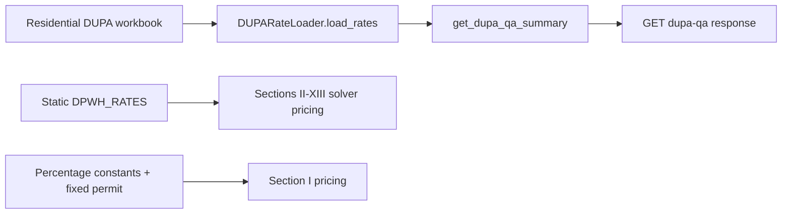

# Current Solver Data Flow

**Task IDs:** S0-002, S0-003
**Repository branch:** `main`
**Source commit:** `97f16aa3fd7b6d8e7cd364b6edc2ac303a5f54e6`
**Scope:** description of the implemented flow only. This document does not introduce a replacement architecture.

## Requested linear view

```text
parser or manual data
-> app adapter
-> project inputs
-> section calculator
-> material and cost result
-> BOQ rows
-> database or API response
```

That chain exists, but the current implementation has three important side channels: sample-project defaults enter at the adapter/process route, static module rates enter every section calculator, and the rebar optimizer/DUPA loader remain separate from the full takeoff path.

## Main process-drawing path



## Stage-by-stage inventory

| Stage | Current function/location | Input shape | Output shape | Current transformation and loss |
|---|---|---|---|---|
| Parser/session source | `process_drawing`, backend/app.py:810-940 | file, drawing_name, optional session_id | parser payload | A missing path can select a sample PDF. A parser exception becomes an empty schedules payload and processing continues. |
| OCR supplement | `_apply_offline_ocr_fallback`, backend/app.py:535-602 | parser payload plus file path | mutated parser payload | Adds locally inferred schedule data. Provenance is not carried into solver fields. |
| App adapter | `_schedules_to_project_inputs`, backend/app.py:605-805 | schedules with footings/columns/beams/slabs/walls | dict keyed 2 through 13 | Starts from SAMPLE_PROJECT_INPUTS, clears only selected structural lists, applies hardcoded defaults, maps partial structural data, and leaves nonstructural demo values. |
| Manual solver boundary | `run_full_takeoff`, backend/engine/fajardo.py:963-1017 | caller-supplied project_inputs | section result map | Manual callers can bypass the app adapter, but must provide compatible keyword dictionaries for every section or receive Python argument errors. |
| Section dispatch | `run_full_takeoff`, lines 986-1007 | one kwargs dict per section | Sections II-XIII results | Calls all 12 direct-trade calculators in fixed order and sums rounded section totals. |
| Quantity and cost kernel | `calculate_section_2_*` through `calculate_section_13_*`, backend/engine/fajardo.py:241-927 | trade-specific geometry/counts | quantities, materials, labor_manday, equipment_hours, cost | Geometry, waste, procurement rounding, and pricing occur in the same functions. Quantity states are not consistently labeled. |
| Rate lookup | `_rate`, `_cost_line`, `DPWH_RATES`, backend/engine/fajardo.py:136-230 | quantity plus rate key | material/labor/equipment line tuple | Sections II-XIII use these helpers with static illustrative rates. Section I bypasses this rate lookup and uses percentage constants plus a fixed permit amount directly. No active DUPA/project rate-set identifier is attached. |
| Section I | `calculate_section_1_general_requirements`, backend/engine/fajardo.py:934-956 | Sections II-XIII subtotal | line_items and total | Creates percentage/lot costs after the direct-trade subtotal. Its line_items are not consumed by the BOQ adapter. |
| BOQ adapter | `_takeoff_to_boq_rows`, backend/app.py:446-504 | full takeoff result | flat BOQ row list | Iterates scalar quantities only, ignores materials/line_items, infers units from names, and allocates aggregate section cost using the sum of mixed units. |
| Local/cloud persistence | `local_save_session`; `supabase_save_session`, called at backend/app.py:903-911 | session metadata and flat BOQ rows | database records | Persists flattened values. The supplied SQL schema lacks formula/rate/quantity-state trace fields. |
| API response | `process_drawing`, backend/app.py:917-940 | parser payload, BOQ rows, takeoff totals | JSON | Returns status success, source label, parser payload, elements, BOQ, and two totals. Detailed section calculation trace is not returned in this route. |

## Data shapes at each solver boundary

### 1. Parser/manual data

The parser-facing shape is a loose `schedules` dictionary with lists such as `footings`, `columns`, `beams`, `slabs`, and `walls`. Field names vary between deterministic nested objects and uppercase vision-extracted labels. Manual callers may instead provide the final section-keyed `project_inputs` shape directly.

### 2. App adapter output

```python
project_inputs = {
    2: {"footing_specs": [...], "slab_area": float, "slab_t": float},
    3: {"elements": [...]},
    4: {"wall_elements": [...]},
    5: {"rebar_elements": [...], "structural_steel_kg": float},
    6: {...},
    # through Section 13
}
```

This object has no field-level source, confidence, unresolved-state, unit metadata, or input hash. In the app path it can contain a mixture of parsed values, hardcoded fallbacks, and untouched sample values.

### 3. Section result

```python
section_result = {
    "quantities": {...},
    "materials": {...},
    "labor_manday": float,
    "equipment_hours": float,
    "cost": {
        "material": float,
        "labor": float,
        "equipment": float,
        "total": float,
    },
}
```

Section I additionally returns `line_items`. Nested quantity maps are used for concrete class, rebar diameter, and door type. No universal cost-line list connects a quantity to its rate key and extended amount.

### 4. Full takeoff result

```python
takeoff = {
    "sections": {1: section_result, ..., 13: section_result},
    "sections_2_to_13_subtotal": float,
    "grand_total_direct_cost": float,
}
```

The subtotal is the sum of each section's rounded `cost.total`. Section I is calculated from that subtotal and added to obtain the grand total.

### 5. BOQ row

```python
boq_row = {
    "item_code": str,
    "section_id": str,
    "division": str,
    "trade": str,
    "description": str,
    "quantity": float,
    "unit": str,
    "material_unit_cost": float,
    "labor_unit_cost": float,
    "equipment_unit_cost": float,
    "total_unit_cost": float,
    "total_amount": float,
    "backup_qty": float,
    "status": "Confirmed",
}
```

The row does not retain the original formula, rate key, source quantity state, waste, procurement rounding, parser evidence, or warnings.

## Side path: rebar optimizer


The optimizer route is implemented at backend/app.py:949-992 and backend/engine/rebar_optimizer.py:46-129. It is **not called** by `calculate_section_5_metals_and_rebar` or `run_full_takeoff`. Therefore Section V pricing uses installed rounded weight, while optimizer purchased weight/scrap is a separate response with no cost or persistence link in the main process-drawing flow.

## Side path: DUPA rate loader



The loader at backend/engine/dupa_loader.py:16-89 scans workbook sheets and the QA endpoint exposes item names. The full takeoff does not consume those rates. Current Sections II-XIII solver cost therefore follows the static dictionary in `fajardo.py`, not the loaded workbook. Section I instead uses percentage constants and a fixed permit amount directly.

## Persistence view

The supplied schema stores the following solver-facing records:

| Table | Stored solver information | Trace not represented |
|---|---|---|
| `backup_computations` | division, item, quantity/unit, component unit costs, total | formula/input/rate versions, quantity states, warnings |
| `boq_checklist` | flat BOQ quantity and prices | same trace gaps |
| `rebar_cutting_schedules` | diameter, stock length/count, cuts, scrap, utilization | original demand set, unresolved cuts, optimizer/rule version |
| `boq_sessions_v2` | drawing name, totals, item count | input source/hash, solver/rate versions, warning state |
| `boq_items_v2` | item identity, flat quantity/unit/rates/amount | calculation lineage and procurement transformation |

See schema/boq_v2_schema.sql:44-122.

## Lossy transitions and trust boundaries

| Boundary | What is lost or silently introduced | Related findings |
|---|---|---|
| Parser payload -> project_inputs | Parser field provenance/confidence is lost; sample values and hardcoded geometry can enter. | DEF-002, DEF-013, DEF-016 |
| Project inputs -> section result | Raw/net/waste/procurement state and input source are not consistently retained. | DEF-004, DEF-005, DEF-009, DEF-023 |
| Rate lookup -> section cost | Rate source/version and item-level cost line are lost. | DEF-010, DEF-020, DEF-021 |
| Section result -> BOQ rows | Materials and Section I line_items are dropped; mixed units are used to create artificial rates. | DEF-003, DEF-015, DEF-028 |
| BOQ rows -> database/API | Formula/input/rate trace and unresolved conditions cannot be reconstructed. | DEF-024 |
| Section V -> optimizer | There is no transition. Installed rebar cost and stock procurement live in separate islands. | DEF-006, DEF-007, DEF-012, DEF-023 |

## Current end-state behavior

For the process-drawing route, the user receives a successful JSON object containing parser context, a flattened BOQ, and summary totals. Local persistence always runs before the response; cloud persistence runs when configured. The complete section result with its `materials`, nested quantities, and individual Section I line items is not the persisted BOQ contract. As a result, the most detailed in-memory calculation state becomes a thinner, partially synthetic representation before it reaches the database or API consumer.
